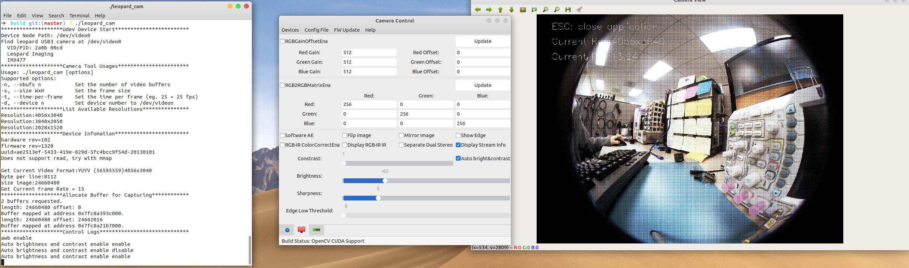
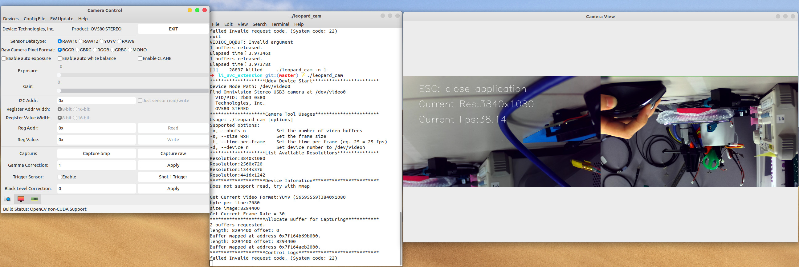
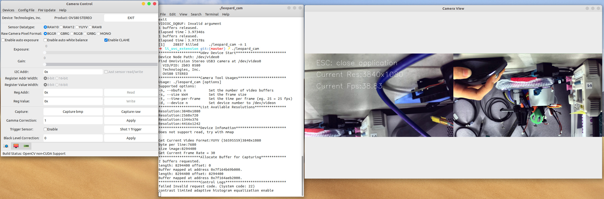
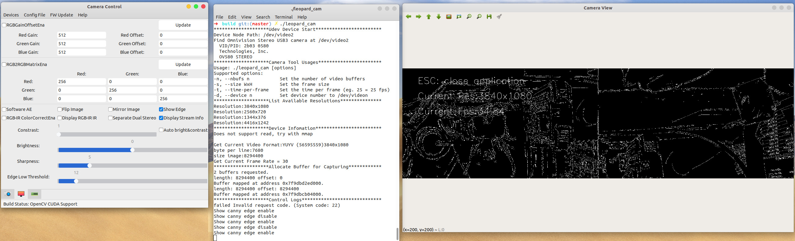

Leopard USB3.0 Camera Linux Camera Tool
=======
This is the sample code for Leopard USB3.0 camera linux camera tool. It is a simple interface for capturing, viewing, controlling video stream from Leopard's uvc compatible devices, with a special emphasis for the linux v4l2 driver. 

For __Leopard USB3.0 Firmware Update Tool__, please refer to [firmware update tool README](/li_firmware_updates/README.md)

[](https://www.gnu.org/licenses/gpl-3.0) [](https://github.com/danyu9394/linux_camera_tool) [](https://github.com/danyu9394/linux_camera_tool/releases/tag/v0.4.2) [](https://github.com/danyu9394/linux_camera_tool/issues?q=is%3Aissue+is%3Aclosed) [](https://github.com/danyu9394/linux_camera_tool/issues?q=is%3Aopen+is%3Aissue)


Table of Contents
-----------------  

- [Leopard USB3.0 Camera Linux Camera Tool](#leopard-usb30-camera-linux-camera-tool)
  - [Table of Contents](#table-of-contents)
  - [Installation](#installation)
    - [Support OS Platforms](#support-os-platforms)
    - [Support OpenCV Versions](#support-opencv-versions)
    - [Hardware Prerequisites](#hardware-prerequisites)
    - [Dependencies](#dependencies)
      - [OpenCV Prerequisites](#opencv-prerequisites)
      - [OpenCV CUDA Support](#opencv-cuda-support)
    - [Build Camera Tool](#build-camera-tool)
    - [Install leopard_cam](#install-leopard_cam)
    - [Uninstall leopard_cam](#uninstall-leopard_cam)
  - [Usages](#usages)
    - [Run Linux Camera Tool on Host PC](#run-linux-camera-tool-on-host-pc)
    - [Run Linux Camera Tool on Docker](#run-linux-camera-tool-on-docker)
    - [Exit Linux Camera Tool](#exit-linux-camera-tool)
    - [Kill Linux Camera Tool Zombie Process](#kill-linux-camera-tool-zombie-process)
  - [Examples](#examples)
    - [Test on RAW sensor 12 Megapixel Sensor IMX477](#test-on-raw-sensor-12-megapixel-sensor-imx477)
    - [Test on RAW sensor 5 Megapixel Sensor OS05A20](#test-on-raw-sensor-5-megapixel-sensor-os05a20)
    - [Test on OV4689-OV580 stereo YUV422 2 Megapixel Cam](#test-on-ov4689-ov580-stereo-yuv422-2-megapixel-cam)
  - [Code Structure](#code-structure)
  - [Declarations](#declarations)
    - [Image Processing Functionalities](#image-processing-functionalities)
      - [Benchmark Results](#benchmark-results)
      - [Datatype Definition for Data Stream](#datatype-definition-for-data-stream)
    - [Auto Exposure](#auto-exposure)
    - [Exposure Time Calculation](#exposure-time-calculation)
  - [Known Bugs](#known-bugs)
    - [Exposure & Gain Control Momentarily Split Screen](#exposure--gain-control-momentarily-split-screen)
    - [SerDes Camera Experiences First Frame Bad When Uses Trigger](#serdes-camera-experiences-first-frame-bad-when-uses-trigger)
  - [Reporting Bugs](#reporting-bugs)
  - [Contributing](#contributing)

---
## Installation
### Support OS Platforms
This application uses `v4l2`(video for linux) API for linux. The related system calls are also UNIX based, e.g. `open()`, `close()`, `fork()` etc. It doesn't support running on Mac OS and Windows. For Windows Camera Tool for your Leopard USB3 camera, please contact [leopard support](mailto:support@leopardimaging.com) for application/source code.
Docker hasn't supported USB video device pass through on Windows. So even running docker, it is suggested you have a linux operating system workstation there.
- `5.0.0-29-generic #31~18.04.1-Ubuntu SMP`
- `4.18.0-17-generic #18~18.04.1-Ubuntu SMP` 
- `4.15.0-20-generic #21~Ubuntu 18.04.1 LTS`
- `4.15.0-32-generic #35~16.04.1-Ubuntu`


### Support OpenCV Versions
Due to OpenCV CUDA support hasn't been updated to 4.0.X, it is suggested to install `3.4.3` for OpenCV CUDA support. 
The non-OpenCV CUDA support part has been tested and verified on the following OpenCV versions 
- `3.4.2`
- `3.4.3` 
- `4.0.1`
- `4.1.1`
  
### Hardware Prerequisites
- __Camera__: any Leopard USB3.0/2.0 cameras
- __Host PC__: with USB3.0 port connectivity 
  
  Some boards like `OV580-STEREO` has more strict voltage requirements toward USB3.0 port. It is highly suggested to use a __USB3.0 powered hub__ to regulate the voltage out from PC's USB3.0 port if a `OV580-STEREO` USB3 device is used. 

  The underlying issue is that different host PCs/USB3 PCIe manufacturers have different USB3 controllers. Some of the USB3 cameras are not able to handle transient voltage droop from the USB3 port from PC. So a __USB3.0 powered hub__ is highly recommended if this issue is repeatable with direct USB3 connection on your host PC. 
  (Any serdes USB3 camera which have an external 12V power supply will be immune to this as you assumed :D)
  - Do a `lsusb` and found your Leopard USB3.0 camera device after connection: VID of our USB device is usually `2a0b` (for more hardware information like OV580-STEREO, please refer to [hardware.h](includes/hardware.h)).
  - Do a `ls /dev/vi*` and make sure there is video device listed. 
  - Once you know which `/dev/videoX` the camera is at, use `./leopard_cam -d X` when you run your camera
- __USB3.0, USB2.0 Connectivity__: 
  If you plug in your USB camera device slow enough to a USB3.0 port, your host PC might still recognize the USB3.0 device as USB2.0. 
  To be able to tell if your host PC has been recognized this USB3.0 camera truly as a USB3.0 device, do a `v4l2-ctl --device=/dev/videoX --all`, where `X` is the device number that being recognized by your PC. And check if its resolution, frame rate listed is the right one, (USB2.0 camera will have much lower bandwidth, so usually small resolution and frame rate).
```console
foo@bar:~$ lsusb ## list all your USB device on your host PC
Bus 002 Device 034: ID 05e3:0612 Genesys Logic, Inc. 
Bus 002 Device 035: ID 2a0b:00cd  
Bus 002 Device 001: ID 1d6b:0003 Linux Foundation 3.0 root hub
Bus 001 Device 035: ID 046d:c52b Logitech, Inc. Unifying Receiver
Bus 001 Device 034: ID 046d:c53d Logitech, Inc. 
Bus 001 Device 031: ID 05e3:0610 Genesys Logic, Inc. 4-port hub
Bus 001 Device 001: ID 1d6b:0002 Linux Foundation 2.0 root hub
foo@bar:~$ lsusb -v -d 2a0b:00cd ## list verbose information on connected Leopard USB3 camera 
Bus 002 Device 035: ID 2a0b:00cd  
Device Descriptor:
  bLength                18
  bDescriptorType         1
  bcdUSB               3.00
  bDeviceClass          239 Miscellaneous Device
  bDeviceSubClass         2 ?
  bDeviceProtocol         1 Interface Association
  bMaxPacketSize0         9
  idVendor           0x2a0b 
  idProduct          0x00cd 
  bcdDevice            0.00
  iManufacturer           1 
  iProduct                2 
  iSerial                 3 
  bNumConfigurations      1
...
foo@bar:~$ ls /dev//vi* ## list all the video device in your host PC
/dev/video0  /dev/video1
```


### Dependencies
Make sure the libraries have installed. Run [configure.sh](configure.sh) in current directory for completing installing all the required dependencies.
```sh
$ chmod +X configure.sh
$ ./configure.sh
```

#### OpenCV Prerequisites
Make sure you have GTK 3 and OpenCV (3 at least) installed. The way you do to install this package varies by operational system.

Gtk3 and Gtk2 don't live together peaceful. If you try to run camera tool and got this error message:

    Gtk-ERROR **: GTK+ 2.x symbols detected. Using GTK+ 2.x and GTK+ 3 in the same proc

It is mostly you have OpenCV build with GTk2 support. The only way to fix it is rebuild OpenCV without GTk2:

    opencv_dir/release$ cmake [other options] -D WITH_GTK_2_X=OFF ..

in order to disable Gtk2 from OpenCV.

```sh
# rebuild OpenCV, this might take a while
# this is just a sample of rebuilding OpenCV, modify them to fit your need
$ rm -rf build/
$ mkdir build && cd build/
$ cmake -D CMAKE_BUILD_TYPE=RELEASE -D CMAKE_INSTALL_PREFIX=/usr/local -D WITH_TBB=ON -D BUILD_NEW_PYTHON_EXAMPLES=ON -D BUILD_EXAMPLES=ON -D WITH_QT=ON -D WITH_OPENGL=ON -D WITH_GTK=ON -D WITH_GTK3=ON -D WITH_GTK_2_X=OFF ..
$ make -j6                     # do a $lscpu to see how many cores for CPU
$ sudo make install -j6

# link OpenCV
$ sudo sh -c 'echo "/usr/local/lib" >> /etc/ld.so.conf.d/opencv.conf'
$ sudo ldconfig
```
#### OpenCV CUDA Support
To build __OpenCV CUDA__ support, please refer to [INSTALL_OPENCV_CUDA.md](INSTALL_OPENCV_CUDA.md) 

### Build Camera Tool
1. Make
   * Use __make__ when you don't need __OpenCV CUDA__ support
```sh
$ make
```

2. CMake
   * Use __cmake__ when you need __OpenCV CUDA__ support
```sh
$ mkdir build
$ cd build
########################################################################
$ cmake ..                      # USE_OPENCV_CUDA is turned off by default
$ cmake -DUSE_OPENCV_CUDA=ON .. # turn on USE_OPENCV_CUDA for OpenCV CUDA support
########################################################################
$ make

# Add to your project
add_subdirectory(linux_camera_tool)
include_directories(
	linux_camera_tool/src/
)

...

target_link_libraries(<Your Target>
	leopard_tools
)
```
### Install leopard_cam
```sh
$ sudo cp ./leopard_cam /usr/bin
```
### Uninstall leopard_cam
```sh
$ sudo rm -f /usr/bin/leopard_cam 
```

---
## Usages
### Run Linux Camera Tool on Host PC
- Run your Linux Camera Tool after installation 
```sh
$ leopard_cam
```
- Run your Linux Camera Tool when you want to assign a specific video device `/dev/videoX`(usually when you have more than one camera in your host PC, and the Linux Camera Tool detected/opened a different device than you want) 
```sh
# either the following four ways
$ leopard_cam -d X
$ leopard_cam -d /dev/videoX
$ leopard_cam --device X
$ leopard_cam --device /dev/videoX
```
- Run your Linux Camera Tool with a different resolution and frame rate than the default one
```sh
$ leopard_cam -s 1280x720 -t 15
```
- For detailed usage of commands in Linux Camera Tool, please run
```sh
$ leopard_cam -h 
```

### Run Linux Camera Tool on Docker
Please refer to [Docker README](/docker/README.md) for more information

### Exit Linux Camera Tool
In the following five ways:
1. Press __ESC, q, Q__ in your keyboard to exit the whole program
2. Use __EXIT__ button on the grid1 control panel to exit the whole program
3. Use __Help -> Exit__ in the menu bar to exit the whole program
4. User __Ctrl + C__ to exit the control panel after exit from camera streaming GUI
5. Unexpected quit results in defunct process, use 
   ```sh
   $ ps
   ``` 
   to see if the leopard_cam still alive, if it is, use 
   ```sh
   $ killall -9 leopard_cam
   ``` 
   to kill the zombie process

### Kill Linux Camera Tool Zombie Process
If you forget to exit both windows and tried to run the camera tool again, it will give you the error of 
`VIDIOC_DQBUF: Invalid argument`, or when something goes wrong unexpected when running Linux Camera Tool, please check your available processes and kill leopard_cam, then restart the camera tool application
```sh
$ ps
$ killall -9 leopard_cam
```
---

## Examples
### Test on RAW sensor 12 Megapixel Sensor IMX477
__Original streaming after debayer for IMX477:__ 
> image is dark and blue
> 

__Modified streaming for IMX477:__
> enabled AWB, gamma correction, black level correction with _non OpenCV CUDA support_
> 

> enable awb, auto brightness & contrast, sharpness control with _OpenCV CUDA support_
> 

### Test on RAW sensor 5 Megapixel Sensor OS05A20
__Modified streaming for OS05A20 full resolution__
> change bayer pattern to GRBG
> enable software AWB, gamma correction
> increase exposure, gain
> 


__Modified OS05A20 resolution to an available one__
> binning mode
> capture raw and bmp, save them in the camera tool directory


### Test on OV4689-OV580 stereo YUV422 2 Megapixel Cam

__Original streaming:__
> Default YUV output
> 

__CLAHE:__
> Run OpenCV CLAHE(Contrast Limited Adaptive Histogram Equalization)
>

__Edge detection(Canny):__
> Run OpenCV Canny edge detection
>

---

## Code Structure
```
$ linux_camera_tool .
├── Makefile                              # for make
├── configure.sh                          
├── CMakeLists.txt                        # for CMake
├── gitlog-to-changelog.md                # automate generating CHANGELOG.md, version number in software
│
├── README.md                             # THIS FILE
├── INSTALL_OPENCV_CUDA.md
├── CHANGELOG.md
├── LICENSE.md
├── AUTHOR.md
│
├── config.json                           # configuration files for automating
├── BatchCmd.txt                          # camera controls
|
├── includes
│   ├── shortcuts.h                       # common used macro functions  
│   ├── hardware.h                        # specific hardware feature support
│   ├── gitversion.h                      # auto-generated header file for revision
│   ├── utility.h                         # timer for benchmark
│   ├── cam_property.h
│   ├── extend_cam_ctrl.h
|   ├── isp_lib.h
│   ├── core_io.h
│   ├── fd_socket.h
|   ├── json_parser.h
│   ├── batch_cmd_parser.h
│   ├── ui_control.h
│   ├── uvc_extension_unit_ctrl.h
│   └── v4l2_devices.h
│
├── src
│   ├── cam_property.cpp                  # gain, exposure, ptz ctrl etc
│   ├── extend_cam_ctrl.cpp               # camera stream, capture ctrl etc
|   ├── isp_lib.cpp                       # ISP using OpenCV
|   ├── core_io.cpp                       # string manipulation for parser
|   ├── fd_socket.cpp                     # file descriptor socket for IPC
|   ├── json_parser.cpp                   # json parser
|   ├── batch_cmd_parser.cpp              # BatchCmd.txt parser
|   ├── ui_control.cpp                    # all GUI related
│   ├── uvc_extension_unit_ctrl.cpp       # all uvc extension unit ctrl
│   └── v4l2_device.cpp                   # udev ctrl
│   
└── test
    └── main.c                              
```
--- 
## Declarations 
### Image Processing Functionalities
Most of the image processing jobs in Linux Camera Tool([code for ISP](src/isp_lib.cpp)) are done by using OpenCV. Since there are histogram matrix calculations and many other heavy image processing involved, enabling these features will slow down the streaming a lot. If you build Linux Camera Tool with __OpenCV CUDA support__, these feature speed won't be compromised a lot. Detailed benchmark result is listed below.

#### Benchmark Results
Benchmark test is performed on a _12M pixel RAW12 bayer_ camera (IMX477) with host PC OpenCV build TBB on.

| Functions                     | Non-CUDA OpenCV Support | Latency | CUDA OpenCV Support | Latency |
|-------------------------------|-------------------------|---------|---------------------|---------|
| `Auto White Balance`          | Yes                     | 55ms    | Yes                 | 3700us  |
| `CLAHE`                       | Yes                     | 40ms    | Yes                 | 7700us  |
| `Gamma Correction`            | Yes                     | 2.7ms   | Yes                 | 1100us  |
| `Sharpness`                   | Yes                     | 200ms   | Yes                 | 20ms    |
| `Show Edge`                   | Yes                     | 20ms    | Yes                 | 16ms    |
| `Color Correction Matrix`     | Yes                     | 18ms    | No                  | N/A     |
| `Perform Shift`               | No                      | 13ms    | No                  | N/A     |
| `Separate Display`            | Yes                     | 9000us  | No                  | N/A     |
| `Brightness`                  | Yes                     | 7ms     | Yes                 | 400us   |
| `Contrast`                    | Yes                     | 7ms     | Yes                 | 400us   |
| `Auto Brightness & Contrast`  | Yes                     | 14ms    | Yes                 | 1180us  |

#### Datatype Definition for Data Stream


### Auto Exposure
Auto exposure is usually implemented on __sensor/ISP__, which when enabled, won't further slow down the streaming. You need to check with camera driver for auto exposure support. If some sensor don't have AE support built-in, the check button in the first tab of Camera Control (`Enable auto exposure`)won't work. 

There is a software generated auto exposure support in the second tab of Camera Control (`Software AE`), you can enable that if you really need AE support for the camera. Since adjusting gain and exposure under linux will experience split screen issue, same thing will happen to this software AE.


### Exposure Time Calculation
Since `V4L2` doesn't provide a easier way to tell you what exact exposure time in _ms_ like what _Windows_ does, here is the explanation for helping you figuring out your camera's current exposure time in _ms_:

`Exposure time = exposure_time_line_number / (frame_rate * total_line_number)`

, where 
1. __exposure_time_line_number__ is the value that display is linux camera tool exposure control.
2. you can get __frame_rate__ from the log message `Get Current Frame Rate =`, don't refer to `Current Fps` that displays in the `Camera View`, that's the frame rate your PC can process, not the physically USB received frame rate from camera.
3. __total_line_number__ is usually around the height of the camera's current resolution, usually slightly larger than that since VD needs blanking. To get the exact __total_line_number__, you might want to read __VTS__ register value for your sensor, which might be a hassle for you so I will only tell you this roughly calculation method...
4. Noticing for exposure time change in Linux Camera Tool Control GUI, the exposure time range will usually be over the camera's resolution height. If you have the exposure value set to be over camera's resolution height, it might affect your frame rate. Since when camera exposure time line number is greater than the total line number, that will slow down your camera's frame rate. This varies from different sensors. Some sensors don't allow that happen, so the exposure time will stick the same when it is over total line number.
  
---
## Known Bugs

### Exposure & Gain Control Momentarily Split Screen
When changing exposure and gain under linux, camera tool will experience split screen issue at the moment change is happened. This issue happens for the USB3 camera that use `manual DMA` in the FX3 driver. For the camera that utilizes `auto DMA`, the image will be ok when exposure and gain change happens. 

For updating driver from manual DMA to auto DMA, you need to ensure:
1. `PTS` embedded information is not needed in each frame
2. The camera board has a `Crosslink` FPGA on the tester board that is able to add uvc header to qualify for `auto DMA`
3. `FX3 driver` need to be updated

### SerDes Camera Experiences First Frame Bad When Uses Trigger
When use triggering mode instead of master free running mode for USB3 SerDes camera, the very first frame received will be bad and should be tossed away. It is recommended to use an external function generator or a dedicated triggering signal for triggering the cameras for the purpose of syncing different SerDes cameras. 

The included `shot 1 trigger` function is only a demonstration on generating one pulse and let camera output one frame after `shot 1 trigger` is clicked once. User should not fully rely on this software generated trigger but use a hardware trigger for sync the camera streaming.


---
## Reporting Bugs
Report bugs by creating a new issue on this Github page: 
https://github.com/danyu9394/linux_camera_tool/issues

If it is clearly a firmware issue: likely some features hasn't been implemented in the driver, please contact Leopard support: [support@leopardimaging.com](mailto:support@leopardimaging.com)

## Contributing
Fork the project and send pull requests, or send patches by creating a new issue on this Github page:
https://github.com/danyu9394/linux_camera_tool/issues


