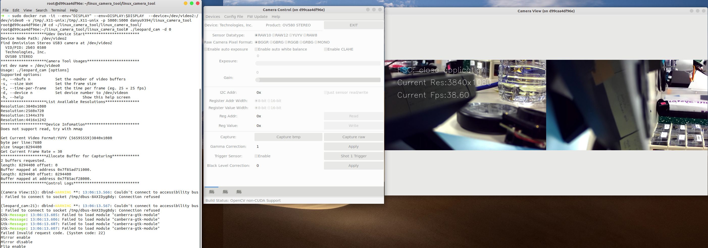

# Running Linux Camera Tool in Docker
Docker is a popular container system. It is a way to containerize the application to put everything that the application need(`ubuntu 16.04, OpenCV 3.4.2, GTK3` etc in our case) into a small image that can be run on __any computer that also has docker on it__. 
Unlike virtual machines, containers do not bundle a full operating system - only libraries and settings required to make the software work are needed. This makes for efficient, lightweight, self-contained systems and guarantees that software will always run the same, regardless if where it is deployed.<sup>1</sup>

Running Linux Camera Tool in Docker eliminates the problem when people having difficulty setting up their work environment. It will be beneficial for user that are: 
1. Not willing to rebuild their `OpenCV` due to system consistency, thinking rebuild OpenCV takes a long time etc
2. Installed an old version of `gcc toolchain`, `OpenCV` that doesn't support some functions that are used in this program on their current Ubuntu machine
   e.g. `C++ STL in C++11`, `cv::forEach()`, `cv::imshow()` 
3. Doesn't have a ubuntu machine available, use other Debian distro of linux that causes UI widgets display incorrectly
   
## Build
You need to install docker on your local computer, please see following [tutorial](https://docs.docker.com/install/linux/docker-ce/ubuntu/#set-up-the-repository).

FYI, you will need to be in superuser to run docker properly. If you feel lazy of typing `sudo` in the front of every time, here is [how to use docker without sudo on ubuntu](https://linoxide.com/linux-how-to/use-docker-without-sudo-ubuntu/)

- __Build your own image from Dockerfile__
You can build the image on your own, note that it will take some time...
```sh
sudo docker build -f Dockerfile .
```
- __Download the pre-built docker image from docker hub__
```sh
sudo docker pull danyu9394/linux_camera_tool:v047
```

## Usage
This is an example of running a Leopard USB3 that currently listed as `/dev/video2` in your host machine onto docker container, assuming you use the image downloaded from docker hub. For more information, please refer to <sup>2</sup>
```sh
sudo xhost +local:root      # allow display something on your screen
sudo docker run -it \
    --env="DISPLAY" --env=DISPLAY:$DISPLAY \
    --device=/dev/video2:/dev/video0 \
    -v /tmp/.X11-unix:/tmp/.X11-unix \
    -p 5000:5000 \
    danyu9394/linux_camera_tool:v047
```
where, 
- `-it` is to start an interactive session
- `--env="DISPLAY" --env=DISPLAY:$DISPLAY` share the host's display environment variable to the container
- `--device=/dev/video2:.dev.video0` is to add host device to container
    - `/dev/video2` is the video device from host that gives to container
    - `/dev/video0` is the video device that has exposed to container and will be used in the container
- `-v /tmp/.X11-unix:/tmp/.X11-unix` helps in X11 forwarding so that we can use functions like `cv::imshow()`
- `-p` set up a port forward. This example map port `5000` in the container to port `5000` on the host
- `danyu9394/linux_camera_tool` is the container image you want to run
  
Once you get inside the container, go to the program directory to run the program
```sh
ls /dev/vi*
cd ~/linux_camera_tool/linux_camera_tool
make clean  # clean the previous build
git pull 
make        # rebuild the latest camera tool
./leopard_cam -d 0
```



To update the image on docker hub
```
# do a docker run and go inside the image
docker ps -a
docker commit CONTAINER_ID danyu9394/linux_camera_tool:v0xx #update the version number as tag
docker push danyu9394/linux_camera_tool:v0xx

#delete all the images
docker rmi $(docker images -q) -f
```
## References
<sup>1</sup>: https://www.docker.com/resources/what-container
<sup>2</sup>: http://wiki.ros.org/docker/Tutorials/GUI